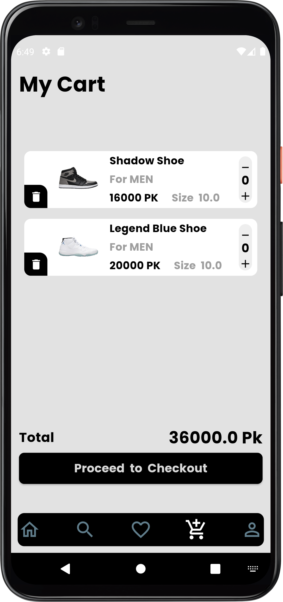

# Shopping E-Commerce App

Welcome to the **Shopping E-Commerce App** repository! This app offers a seamless and user-friendly online shopping experience for customers, featuring sleek designs, intuitive navigation, and comprehensive shopping functionalities.

---

## Features
**Responsive UI:** Optimized for both Android and Web platforms, offering a smooth and adaptive shopping experience.

**Categorized Products:** Browse through Men’s and Women’s Shoes with real-time data dynamically fetched from APIs.

**Advanced Search & Filters:** Quickly find products with advanced search options and filter them by gender, categories, price range, and brand.

**Favorites Management:** Save products to your favorites list for quick access and easy management.

**Cart Functionality:** Add items to your cart with dynamic updates and proceed to checkout seamlessly.

**Product Details:** View detailed product pages with descriptions, size selection, and pricing information.

**Personalized Profile:** Access and manage orders, coupons, settings, and other profile options in one place.

**Secure Login Options:** Sign in securely via email or social accounts like Google and Facebook.

**Offline Capability:** Hive database ensures data persistence and smooth functionality even when offline.

---

## Screenshots


### Home Screen


### Product Details


### Favorites


### Cart


### Login/Sign-Up


### Search & Filters


### Profile


---

## Tech Stack
- **Flutter**: For building a responsive and cross-platform application.
- **Dart**: Core programming language for Flutter development.
- **Firebase**: User Authentication.
- **Hive Database**: Local storage for offline capabilities.
- **API Integration**: For dynamic product data fetching.
- **MVVM Architecture**: For clean and scalable code organization.
- **State Management**: Provider for state handling.

---

## Installation

1. Clone the repository:
   ```bash
   git clone https://github.com/your-username/shopping-ecommerce-app.git
   ```
2. Navigate to the project directory:
   ```bash
   cd shopping-ecommerce-app
   ```
3. Install dependencies:
   ```bash
   flutter pub get
   ```
4. Run the app:
   ```bash
   flutter run
   ```

---

## Contributing
We welcome contributions! Please follow these steps:
1. Fork the repository.
2. Create a new branch for your feature/bug fix.
3. Commit your changes.
4. Open a pull request.

---

## License
This project is licensed under the MIT License. See the [LICENSE](LICENSE) file for details.

---

## Contact
For any inquiries or feedback, please reach out:
- **Email**: tufailmallah39@gmail.com
- **GitHub**: [Your GitHub Profile](https://github.com/Tufail-Ahmed1)

---

Thank you for exploring the Shopping E-Commerce App! Happy shopping! 🛍️

